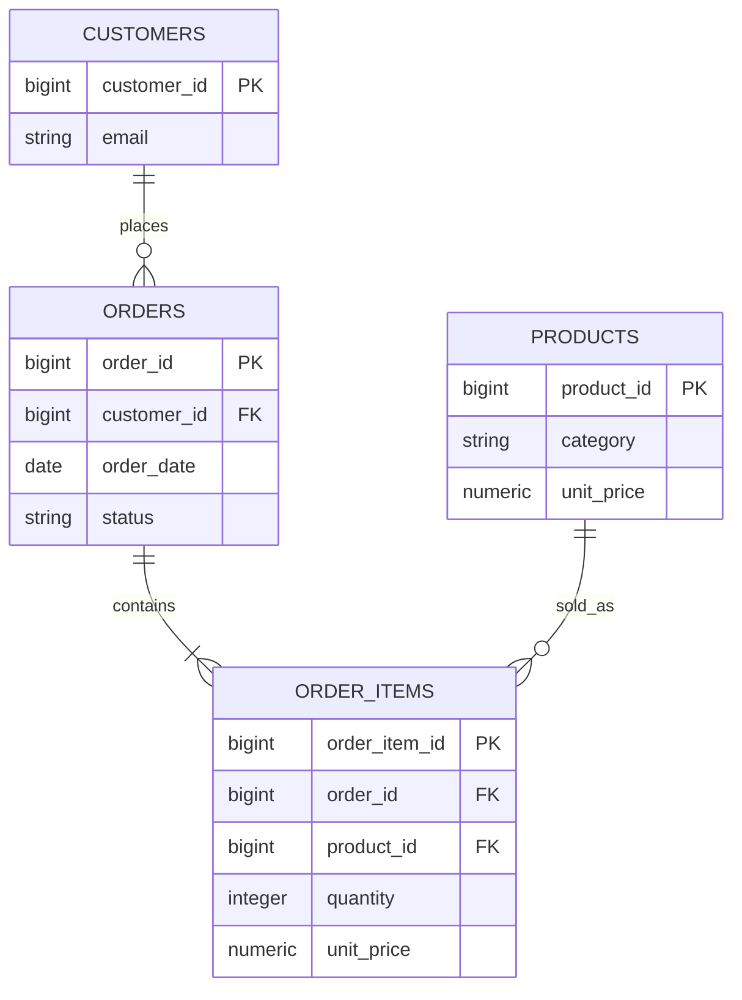

# Task 2: SQL & Data Extraction

A local PostgreSQL 16 analytics stack for a cleaned e-commerce dataset. It demonstrates relational modeling, production-style extraction with Python/Pandas, and business reporting queries.

## Quick start

1. Copy `.env.example` to `.env` and change passwords for anything beyond local learning.
2. Start PostgreSQL and pgAdmin:

   ```powershell
   docker compose up -d
   ```

3. Install Python dependencies in a virtual environment:

   ```powershell
   python -m venv .venv
   .\.venv\Scripts\Activate.ps1
   pip install -r requirements.txt
   ```

4. Load and normalize the raw Online Retail II export:

   ```powershell
   python -m src.ingest_pipeline
   ```

   The loader reads `data/raw/online_retail_II.csv`, removes unusable rows and returns records with missing customer IDs, classifies `C...` invoices as cancelled, and normalizes the result into the four relational tables. The smaller files in `data/processed/` remain fixtures for lightweight experiments.

5. Run `sql/06_views.sql`, then open `notebooks/sql_integration.ipynb` and select the same Python environment.

PostgreSQL is available at `localhost:5432`; pgAdmin is at `http://localhost:5050`. In pgAdmin, register host `postgres` (the Compose service name), port `5432`, and the credentials from `.env`.

## Data model



`order_items.unit_price` is the historical price captured at checkout. Revenue reports include only `completed` orders and calculate `quantity * order_items.unit_price`.

## SQL learning path

- `01_schema_setup.sql`: tables, checks, keys, and foreign keys.
- `02_data_ingestion.sql`: psql bulk `\\copy` commands.
- `03_fundamentals.sql`: filtering, pagination, four join types, and aggregation.
- `04_ctes_and_windows.sql`: CTE pipelines, subqueries, ranking, and navigation functions.
- `05_business_metrics.sql`: monthly trends, top customers, running totals, moving averages, and cohorts.
- `06_views.sql`: reusable reporting views.
- `07_indexing_benchmarks.sql`: before/after `EXPLAIN (ANALYZE, BUFFERS)` and B-tree indexes.

## Benchmarking

Run the benchmark against a representative production-sized copy, not only the fixture. Record planning time, execution time, shared buffer hits/reads, and rows removed by filter from both plans. Indexes should be retained only when the workload shows a repeatable improvement and their write/storage cost is acceptable.

## Security and operations

`.env` is ignored and credentials are never required in source code. `DatabaseManager` uses SQLAlchemy pooling, context-managed transactions, `text()` with bound parameters, and `pandas.read_sql()` for DataFrame extraction. Do not interpolate user input into SQL identifiers or query strings.
